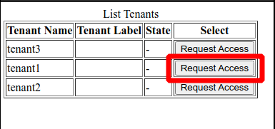
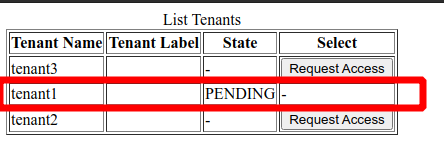
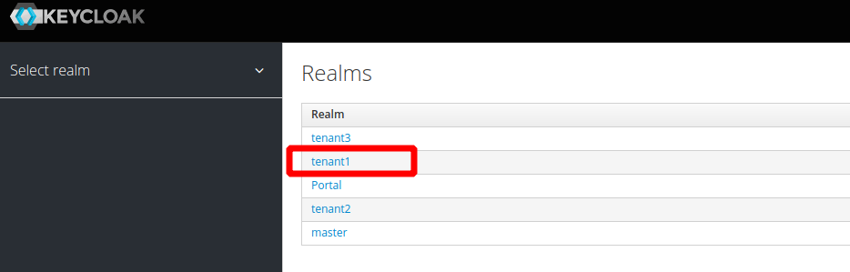
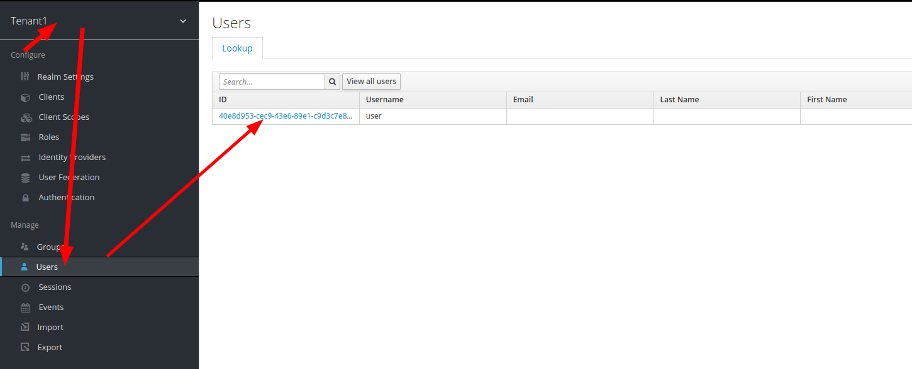
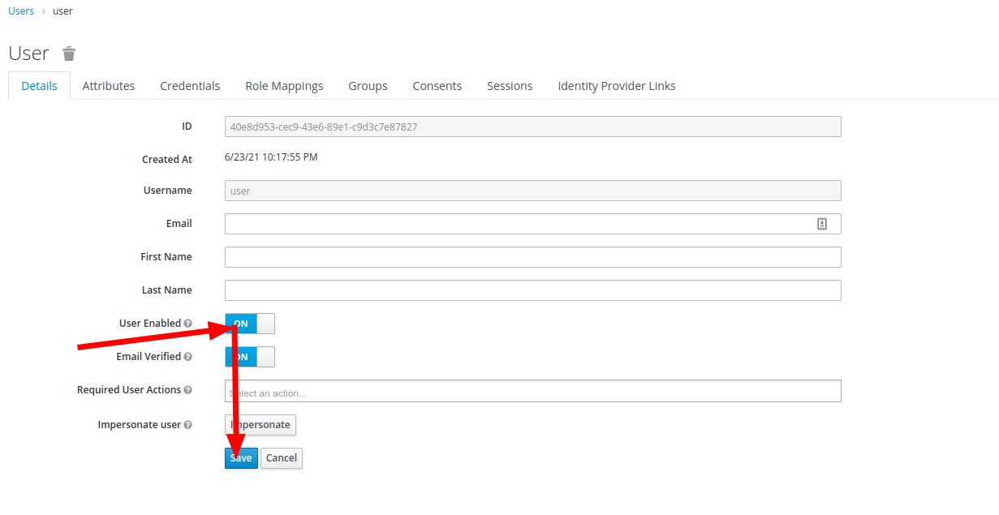
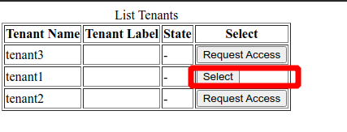

# Example cross-tenant expressjs/lambda-edge/devserver with tenant selector application and approval process

## Description
Internal tenant users can login using url http://localhost:3000/tenants/<TENANT Name> but external users(another company(s) that works with many tenants).
All external users are authenticated through a separate realm and can request access to any tenants.
Only Tenant admin and master admin can approve the request.

## Setup Tenant Idp (only for Internal Tenant Users)
each tenant can use own IDP for internal users. ( For example OKTA, Google, Facebook , etc...)
For that need to add identityProviders configuration to  [ApiConfig.json](./development/ApiConfig.json).
```
  "identityProviders": {
    "multiTenant":"idp"
  },
```
```
{
  "multiTenantAdapterOptions": {
    "multiTenantAdapterOptions": {},
    "keys":{
      "privateKey":{
        "key": "..."
      },
      "publicKey":{
        "key": "..."
      }
    }
  },
  "identityProviders": {
    "multiTenant":"idp"
  },
  "storageType": "...",
  "keys": {
    "privateKey": {
      "key": "..."
    },
    "publicKey": {
      "key": "..."
    }
  }
}
```
- create Identity Provider with alias "idp"


After that when you open http://localhost:3000/tenants/<TENANT Name> you will be redirected to the tenant identity provider.


# Run Docker
Using the image from https://hub.docker.com/r/jboss/keycloak/
```
docker run -p 8080:8080 -e JAVA_OPTS="-Dkeycloak.profile.feature.scripts=enabled -Dkeycloak.profile.feature.upload_scripts=enabled -server -Xms64m -Xmx512m -XX:MetaspaceSize=96M -XX:MaxMetaspaceSize=256m -Djava.net.preferIPv4Stack=true -Djboss.modules.system.pkgs=org.jboss.byteman -Djava.awt.headless=true" -e KEYCLOAK_USER=admin -e KEYCLOAK_PASSWORD=admin  -v `pwd`:/express  -e KEYCLOAK_IMPORT=/express/example-realm-export.json  jboss/keycloak
```
- initialization keycloak for tenant Selector application
```
./initKeycloak.sh
```
- add Realms
```
./addTenant.sh -n tenant1
./addTenant.sh -n tenant2
...
./addTenant.sh -n tenantN
```

**users:**

| tenant/realm | User      | Password   |
|:-------------|:-----------|:-----------|
| portal      | user    |user     |

# Start Tenant Selector application
```
cd tenantSelectorApp
npm i
npm run start
```

# Request Access to specific tenant
 - Request Access
 
 - wait approval request
 

# Approval process
 Only tenant admin or master admin can approve request

1. open [keycloak admin console](http://localhost:8080/auth/admin/master/console/#/realms) with
 ```
 username: admin
 password: admin
 ```
2. select tenant
 
3. select broker account
 
4. enable broker account
 
5. Refresh Tenant Selector page
 

You can now switch tenants without prompting for credentials.

# Development

## **Run localhost development server**
```bash
cd development
npm i
npm run start
```

# Deploy production package to Lambda@Edge

1. **Prepare frontend static resources**
```bash
cd development
npm i
npm run build

```
2. **Build Lambda@Edge and expressjs package**
```
cd production
npm i
npm run build
```
3. **Run Keycloak docker image accessible from the Internet**
```
docker run -p 8090:8080 -e JAVA_OPTS="-Dkeycloak.profile.feature.scripts=enabled -Dkeycloak.profile.feature.upload_scripts=enabled -server -Xms64m -Xmx512m -XX:MetaspaceSize=96M -XX:MaxMetaspaceSize=256m -Djava.net.preferIPv4Stack=true -Djboss.modules.system.pkgs=org.jboss.byteman -Djava.awt.headless=true" -e KEYCLOAK_USER=admin -e KEYCLOAK_PASSWORD=admin  -v `pwd`:/express  -e KEYCLOAK_IMPORT=/express/example-realm-export.json  jboss/keycloak
ngrok http 8090
```

4. **Run CDK Deploy Script**
```
cd production/keycloak-lambda-cdk
npm i
./deploy.sh  -n <BucketName> -r <ARN ROle> --keycloakUrl https://834d39e42544.ngrok.io --profile <AWS PROFILE>
```

# Run as ExpressJS Server:

1. **Prepare frontend static resources**
```bash
cd development
npm i
npm run build

```

2. **Build Lambda@Edge and expressjs package**
```
cd production
npm i
npm run build
```

3. **run expressjs package**

```bash
cd dist/server
node server.js
```
