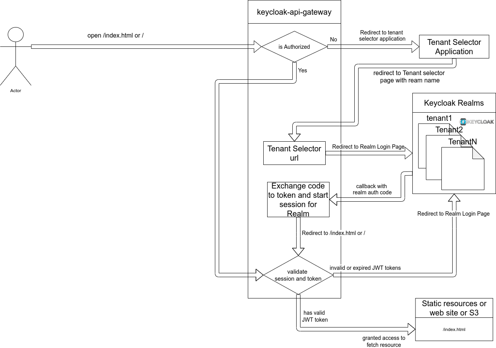

# Example Multi-tenant expressjs/lambda-edge/devserver with tenant selector application

# Run Docker
Using the image from https://hub.docker.com/r/jboss/keycloak/
```
docker run -p 8090:8080 -e JAVA_OPTS="-Dkeycloak.profile.feature.scripts=enabled -Dkeycloak.profile.feature.upload_scripts=enabled -server -Xms64m -Xmx512m -XX:MetaspaceSize=96M -XX:MaxMetaspaceSize=256m -Djava.net.preferIPv4Stack=true -Djboss.modules.system.pkgs=org.jboss.byteman -Djava.awt.headless=true" -e KEYCLOAK_USER=admin -e KEYCLOAK_PASSWORD=admin  -v `pwd`:/express  -e KEYCLOAK_IMPORT=/express/example-realm-export.json  jboss/keycloak
```
- initialization keycloak for tenant Selector application
```
./initKeycloak.sh
```
- add Realms
```
./addTenant.sh -n tenant2
./addTenant.sh -n tenant3
...
./addTenant.sh -n tenantN
```

**users:**

| tenant/realm | User      | Password   |
|:-------------|:-----------|:-----------|
| tenant1      | tenant1    |tenant1     |
| tenant2      | tenant2    |tenant2     |
| tenant3      | tenant3    |tenant3     |
| tenantN      | tenantN    |tenantN     |

# Start Tenant Selector application
```
cd tenantSelectorApp
npm i
npm run start
```

# Development

## **Run localhost development server**
```bash
cd development
npm i
npm run start
```

# Deploy production package to Lambda@Edge

1. **Prepare frontend static resources**
```bash
cd development
npm i
npm run build

```
2. **Build Lambda@Edge and expressjs package**
```
cd production
npm i
npm run build
```
3. **Run Keycloak docker image accessible from the Internet**
```
docker run -p 8090:8080 -e JAVA_OPTS="-Dkeycloak.profile.feature.scripts=enabled -Dkeycloak.profile.feature.upload_scripts=enabled -server -Xms64m -Xmx512m -XX:MetaspaceSize=96M -XX:MaxMetaspaceSize=256m -Djava.net.preferIPv4Stack=true -Djboss.modules.system.pkgs=org.jboss.byteman -Djava.awt.headless=true" -e KEYCLOAK_USER=admin -e KEYCLOAK_PASSWORD=admin  -v `pwd`:/express  -e KEYCLOAK_IMPORT=/express/example-realm-export.json  jboss/keycloak
ngrok http 8090
```

4. **Run CDK Deploy Script**
```
cd production/keycloak-lambda-cdk
npm i
./deploy.sh  -n <BucketName> -r <ARN ROle> --keycloakUrl https://834d39e42544.ngrok.io --profile <AWS PROFILE>
```

# Run as ExpressJS Server:

1. **Prepare frontend static resources**
```bash
cd development
npm i
npm run build

```

2. **Build Lambda@Edge and expressjs package**
```
cd production
npm i
npm run build
```

3. **run expressjs package**

```bash
cd dist/server
node server.js
```
